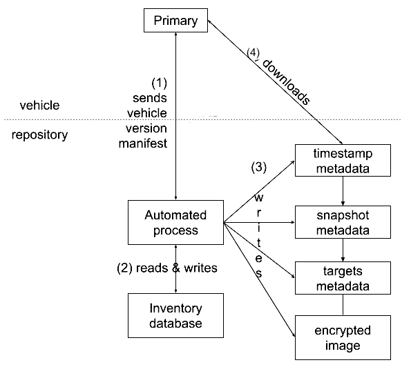

# Setting up Uptane repositories

This section outlines recommended procedures for the one-time operations that an OEM and its suppliers SHOULD perform when they set up Uptane for the first time. In particular, they SHOULD correctly configure the Director and Image repositories, and make sure they have access to a secure source of time, so that the impact of a repository/server compromise is as limited as possible.

## Secure source of time

Without access to a secure source of time, ECUs may be prevented from receiving the most recent updates. If the ECU's time is set too far ahead, it will determine that the current valid metadata is expired and thus be unable to perform an update. If the ECU's time is set too far behind, an attacker can freeze or replay old metadata to the ECU. (ECUs in Uptane will not accept an earlier time than what has previously been seen and signed with the same key.)

If a Primary ECU does not have a secure clock, then that Primary ECU SHALL use some other secure external means to acquire accurate time. If a Secondary ECU does not have a secure clock, then the ECU SHALL use the time messages from its Primary ECU to acquire accurate time. The
following subsection describes how time servers can be used in an Uptane implementation.

### External sources of time

The IETF Network Time Protocol v4 [NTPv4, RFC 5905](https://datatracker.ietf.org/doc/rfc5905) with IETF Network Time Security for the Network Time Protocol [NTS for NTP, RFC 8915](https://datatracker.ietf.org/doc/html/rfc8915) SHOULD be used by an ECU to acquire accurate time. If IETF NTPv4 (or a higher version) is used, then that ECU SHALL conform to IETF Network Time Protocol Best Current Practices [BCP 223 / RFC 8633](https://datatracker.ietf.org/doc/rfc8633/). If IETF NTPv4 (or higher version) is used, then that ECU SHALL discard any received NTP mode 6 and mode 7 packets to prevent a DDOS attack caused by an old (1989) NTP implementation bug described [here](http://blog.cloudflare.com/the-ddos-that-knocked-spamhaus-offline-and-ho) and [here](https://us-cert.cisa.gov/ncas/alerts/TA14-013A).

The work-in-progress [IETF Roughtime protocol](https://datatracker.ietf.org/doc/draft-ietf-ntp-roughtime/) and the [IETF Roughtime Ecosystem](https://datatracker.ietf.org/doc/draft-ietf-ntp-roughtime-ecosystem/) MAY be used by an ECU to acquire sufficiently accurate time to verify certificates (i.e., expiration) and signatures (i.e., freshness). Note that these are a revision and enhancement of the original [Google Roughtime](https://roughtime.googlesource.com/roughtime). See also the [Cloudflare implementation](https://github.com/cloudflare/roughtime).

The US Global Positioning System (GPS), originally Navstar GPS, SHOULD NOT be used as a secure time source by any Uptane ECU, because spoofing attacks against the unsecured, civilian GPS signals are common, as described [here](https://www.euractiv.com/section/defence-and-security/news/russia-responsible-for-massive-satellite-system-spoofing-study-finds/) and [here](https://rin.org.uk/blogpost/1706945/332376/What-is-spoofing-and-how-to-ensure-GPS-security).
.
#### Changes to the Director repository

If an external time source is in use, a representation of its public key is CONDITIONALLY REQUIRED in Director repository Root metadata.

If an external time source is implemented AND partial verification Secondaries are used, the following metadata is CONDITIONALLY REQUIRED in the Director repository's Targets metadata:

* A representation of the public key(s) for the external time source, similar to the representation of public keys in Root metadata.

Listing the public key of the external time source in Director Targets metadata is necessary to allow partial verification Secondaries to perform key rotation.

#### Changes to a Primary

If an external time source is implemented, the Primary SHOULD follow its stipulated procedure for verifying the time. This procedure occurs after the vehicle version manifest is sent and will fulfill the [Download and check current time](https://uptane.github.io/papers/uptane-standard.2.0.0.html#check_time_primary) step of the Uptane Standard.

If the response of the external time source meets verification criteria, update the Primary ECU's clock and retain the time source response for distribution to Secondary ECUs. If it fails to meet this criteria, discard the response and continue the procedure without an updated time.  

#### ECU version report

The ECU version report from each Secondary may contain a token to be sent to the external time source in whatever manner the implementer chooses.  

#### Changes to all ECUs

After the vehicle has been assembled, ECUs MAY receive an attestation of the current time as downloaded from the external time source.

As the first step to verifying metadata, described in the Standard for both the [Primary](https://uptane.github.io/papers/uptane-standard.2.0.0.html#check_time_primary) and [Secondaries](https://uptane.github.io/papers/uptane-standard.2.0.0.html#verify_time), the ECU SHOULD load and verify the most recent time from the designated time source by following its designated procedure. This will likely include verifying that the signatures on the downloaded time are valid

If all steps are completed without error, the ECU SHOULD overwrite its current attested time with the time it has just downloaded. 

If any check fails, the ECU SHOULD NOT overwrite its current attested time, but SHOULD jump to the last step ([Create and send version report](https://uptane.github.io/uptane-standard/uptane-standard.html#create_version_report))to report the error.

#### Changes to check Root metadata

In order to prevent a new time source from accidentally causing a rollback warning, the clock will be reset as folllows: check the time source key after updating to the most recent Root metadata file. If the key is listed in the Root metadata has been rotated, reset the clock used to set the expiration of metadata to a minimal value (e.g., zero, or any time that is guaranteed to not be in the future based on other evidence).  It will be updated in the next cycle.

#### Changes to partial verification Secondaries

As partial verification Secondaries only check the Targets metadata from the Director repository, the time source keys on these ECUs will be checked when verifying the Targets metadata. To do this, check the key after verifying the most recent Targets metadata file. If the external time source key is listed in the Targets metadata and has been rotated, reset the clock used to determine the expiration of metadata to a minimal value as described above.

#### Time source key compromise

In the event of a key compromise for an external time source, an attacker would be able to return a time attestation that contains an arbitrary time. The attacker could then either:

* Make all metadata appear to be expired. If the returned time is far in the future, the vehicle would interpret all Uptane metadata as expired. The vehicle would be unable to verify the metadata, thus creating a denial of service.

* Make expired metadata appear to be current. If the returned time is in the past, Uptane metadata that was valid at that point in the past will seem current to the vehicle, thus allowing for a freeze attack. This cannot be used for a rollback attack as the ECU will not accept a time earlier than the time of their previous update.

All of these attacks can be mitigated by rotating any key associated with an external time in Root metadata, as described in [Managing signing keys and metadata expiration](https://uptane.github.io/deployment-considerations/key_management.html).

## What suppliers should do

**Figure 1.** *Diagram showing supplier signing arrangements. Suppliers are free to ask the OEM to sign images on its behalf (supplier A), or can sign them itself (supplier B). In the latter case, it MAY also delegate some or all of this responsibility to others (supplier C).*

Either the OEM or a tier-1 supplier SHOULD sign for images for any ECUs produced by that supplier, so unsigned images are never installed. This provides security against arbitrary software attacks. An OEM will decide whether or not a tier-1 supplier SHOULD sign its own images. Otherwise, the OEM will sign images on behalf of the supplier, and the supplier SHOULD only deliver update images to the OEM as outlined under the [Normal Operating Guidelines] (https://uptane.github.io/deployment-considerations/normal_operation.html) section of this document. If the supplier signs its own images, it MUST first set up roles and metadata using the following steps:

1. Generate a number of offline keys used to sign its metadata. In order to provide compromise resilience, these keys SHOULD NOT be accessible from the Image repository. The supplier SHOULD take great care to secure these keys, so a compromise affects some, but not all, of its ECUs. The supplier SHOULD use the threshold number of keys chosen by the OEM.
2. Optionally, delegate images to members of its organization (such as its developers), or to tier-2 suppliers (who MAY further delegate to tier-3 suppliers). Delegatees SHOULD recursively follow these same steps.
3. Set an expiration timestamp on its metadata using a duration prescribed by the OEM.
4. Register its public keys with the OEM using some out-of-band mechanism (e.g., telephone calls or certified mail).
5. Sign its metadata using the digital signature scheme chosen by the OEM.
6. Send all metadata, including delegations, and associated images to the OEM.

A tier-1 supplier and its delegatees MAY use the [Uptane repository and supplier tools](https://github.com/uptane/uptane) to produce these signed metadata.

## What the OEM should do

The OEM sets up and configures the Director and Image repositories. To host these backend services, the OEM MAY use its own private infrastructure, or cloud computing.

### Director repository

*Note that all information about setting up signing keys for this repository can be found in the [Managing signing keys and metadata expiration](https://uptane.github.io/deployment-considerations/key_management.html) section of this document.*

In order to provide on-demand customization of vehicles, the OEM SHALL also set up the Director repository following the guidance in the [Uptane Standard](https://uptane.github.io/papers/uptane-standard.2.0.0.html#director_repository). In addition, an OEM must keep in mind the following factors. Unlike the Image repository, the Director repository:

1. is managed by automated processes
2. uses online keys to sign Targets metadata
3. does not delegate images
4. generally provides different metadata to different Primaries
5. MAY encrypt images per ECU, and
6. produces new metadata on each request from a Primary.

**Steps to initialize the repository**

In order to initialize the repository, an OEM SHOULD perform the following steps:

1. Set up the storage mechanism according to the directions for the chosen protocol. For example, the OEM might need to set up a ZFS filesystem.
2. Set up the transport protocol, following the details of the chosen systems. For example, the OEM may need to set up an HTTP server with SSL/TLS enabled.
3. Set up the private and public APIs to interact over the chosen transport protocol.
4. Set up the Root, Timestamp, Snapshot, and Targets roles.
5. If the Director will be serving per-device encrypted images, copy all relevant images from the Image repository.
6. Initialize the inventory database with the information necessary for the Director repository to perform dependency resolution, or encrypt images per ECU. This information includes: (1) metadata about all available images for all ECUs on all vehicles, (2) dependencies and conflicts between images, and (3) ECU keys.
7. Set up and run the automated process that communicates with Primaries.

The automated process MAY use the repository tools from our [Reference Implementation](https://github.com/uptane/uptane) to generate new metadata.

#### Roles

**Figure 2.** *A proposed configuration of roles on the Director repository.*

Unlike the Image repository, the Director repository does not delegate images. Therefore, the Director repository SHOULD contain only the Root, Timestamp, Snapshot, and Targets roles, as illustrated in Figure 2. In the following subsections, we will discuss how metadata for each of these roles is produced.

#### Private API to update images and the inventory database

An OEM SHOULD define a private API for the Director repository that is able to: (1) upload images, and (2) update the inventory database. This API is private in the sense that only the OEM should be able to perform these actions.

This API SHOULD require authentication, so that each user is allowed to access only certain information. The OEM is free to use any authentication method as long as it is suitably strong. Examples include [client certificates](https://docs.microsoft.com/en-us/archive/blogs/kaushal/client-certificates-vs-server-certificates), a password, or an API key encrypted over TLS. For additional security, the OEM may use [multi-factor authentication](https://en.wikipedia.org/wiki/Multi-factor_authentication) that utilizes more than one authentication method.

In order to allow automated processes on the Director repository to perform their respective functions, without also allowing any attackers who might compromise the repository to tamper with the inventory database, it is strongly RECOMMENDED that these processes should have some boundaries. That is, the automated processes SHOULD be able to read any record in the database and write new records, but SHOULD NOT be able to update or delete existing records.

#### Public API to send updates

**Figure 3.** *How Primaries would interact with the Director repository.*

An OEM SHOULD define a public API to the Director repository so that it is able to send updates to vehicles. This API can be designed to the wishes of the OEM, and can use either a push or pull model to send updates to Primaries. The difference between the models lies in whether or not a running vehicle can be told to immediately download an update (via a push), or can wait until a pull occurs.

Either way, the OEM can control how often updates are released to vehicles. In the push model, the OEM can send an update to a vehicle whenever it likes, as long as the vehicle is online. In the pull model, the OEM can configure the frequency at which Primaries pull updates. In most realistic cases, there will be little practical difference between the two models.

There is also no significant difference between these methods when it comes to resistance to denial-of-service (DoS) attacks or flash crowds. In the push model, a vehicle can control how often updates are pushed to it, so that vehicles can withstand DoS attacks, even if the repository has been compromised. In the pull model, the repository can similarly stipulate when vehicles SHOULD download updates, and how often.

Regardless of what model is used to send updates, as illustrated in Figure 4, the API SHOULD allow a Primary to:
* send a vehicle version manifest (step 1)
* download associated metadata and image files (step 4).

The API MAY require authentication, depending on the OEM's requirements.

#### Sending an update

Sending an update from the Director repository to a Primary requires the following five steps, as shown in Figure 3.

1. The Primary sends its latest vehicle version manifest to the Director repository via an automated process.
2. The automated process performs a dependency resolution. It reads associated information about this vehicle, such as ECU identifiers and keys, from the inventory database. It checks that the signatures on the manifest are correct, and adds the manifest to the inventory database. Then, using the given manifest, it computes which images SHOULD be installed next by these ECUs. It SHOULD record the results of this computation on the inventory database so there is a record of what was chosen for installation. If there is an error at any point of this step, due to incorrect signatures, or anything unusual about the set of updates installed on the vehicle, then the Director repository SHOULD also record it, so the OEM can be alerted to a potential risk. Repository administrators MAY then take manual steps to correct the problem, such as instructing the vehicle owner to visit the nearest dealership.
3. Using the results of the dependency resolution, the automated process signs fresh Timestamp, Snapshot, and Targets metadata about the images that SHOULD be installed next by these ECUs. Optionally, if the OEM requires it, it MAY encrypt images per ECU, and write them to its storage mechanism. If there are no images to be installed or updated, then the Targets metadata SHOULD contain an empty set of targets.
4. The Primary downloads the metadata and image files.

Since the automated process is continually producing new metadata files (and, possibly, encrypted images), these files SHOULD be deleted as soon as Primaries have consumed them, so that storage space can be reclaimed. This MAY be done by simply tracking whether Primaries have successfully downloaded these files within a reasonable amount of time.

### Image repository

*Note that all information about setting up signing keys for this repository can be found in the [Managing signing keys and metadata expiration](https://uptane.github.io/deployment-considerations/key_management.html) section of this document.*

Finally, in order to provide compromise resilience, the OEM MUST set up the [Image repository](https://uptane.github.io/papers/uptane-standard.2.0.0.html#image-repository) following the guidance in the Uptane Standard. The Image repository differs from the Director repository in a number of ways. First, it is managed by human administrators who use offline keys to sign Targets metadata. It also MAY delegate images to suppliers, and it provides the same metadata to all Primaries. Lastly, it does not encrypt images per ECU, and it updates its metadata and images relatively infrequently (e.g., every two weeks or monthly).

**Steps to initialize the repository**

In order to initialize the repository, an OEM SHOULD perform the following steps. Note that, as with the Director repository, all users are expected to follow basic set up instructions, as well as
the specific set up instructions mandated by the users' choices of storage mechanisms and protocols.
1. Set up the storage mechanism.
2. Set up the transport protocol.
3. Set up the private and public APIs to interact over the chosen transport protocol.
4. Set up the Root, Timestamp, Snapshot, and Targets roles.
5. Sign delegations from the Targets role to all tier-1 supplier roles. The public keys of tier-1 suppliers SHOULD be verified using some out-of-band mechanism (e.g., telephone calls or certified mail), so that the OEM can double-check their authenticity and integrity.
6. Upload metadata and images from all delegated Targets roles (including tier-1 suppliers). Verify the metadata and images, and add them to the storage mechanism.

An OEM and its suppliers MAY use the repository and supplier tools from the [Reference Implementation](https://github.com/uptane/uptane) to produce new metadata.

#### Roles

**Figure 4.** *A proposed configuration of roles on the Image repository.*

Using delegations allows the OEM to: (1) control which roles sign for which images, (2) control precisely which Targets metadata vehicles need to download, and (3) distribute, revoke, and replace public keys used to verify Targets metadata, and hence, images. In order to set up delegations, an OEM and its suppliers MAY use the configuration of roles illustrated in Figure 4. There are two important points.

* The OEM maintains the Root, Timestamp, Snapshot, and Targets roles, with the Targets role delegating images to their respective tier-1 suppliers.
* There SHOULD be a delegated Targets role for every tier-1 supplier, so that the OEM can:
  * limit the impact of a key compromise.
  * precisely control which Targets metadata vehicles need to download.

The metadata for each tier-1 supplier MAY be signed by the OEM (e.g., supplier A), or the supplier itself (e.g., suppliers B and C). In turn, a tier-1 supplier MAY delegate images to members of its organization, such as supplier C who has delegated a subset of its images to one of its developers, or to its tier-2 suppliers who MAY delegate further to tier-3 suppliers.

Every delegation SHOULD be prefixed with the unique name of a tier-1 supplier, so that the filenames of images do not conflict with each other. Other than this constraint, a tier-1 supplier is free to name its images however it likes. For example, it MAY use the convention "supplier-X-ECU-Y-version-Z.img" to denote an image produced by supplier X, for ECU model Y, and with a version number Z.

#### Public API to download files

An OEM SHOULD define a public API for Primaries to use when downloading metadata and images to the Image repository. This API can be defined in whatever manner the OEM wishes.

Depending on the OEM's requirements, this API MAY require authentication before Primaries are allowed to download updates.  Such a choice affects only how certain the OEM can be that it is communicating with authentic Primaries, and not how resilient ECUs are to a repository compromise. The OEM is free to use any authentication method.

#### Using images from multiple locations

Uptane implementations may sometimes need to accommodate update systems where existing software comes from several different locations. Implementers may assume that this would mandate the use of multiple different Image repositories in any equivalent Uptane implementation. However, this is rarely necessary, and using multiple Image repositories (implemented via [repository mapping metadata as described in TAP-4](https://github.com/theupdateframework/taps/blob/master/tap4.md)) would require a significantly larger effort.

In almost all cases, it is preferable to have a single Image repository containing all of the Uptane metadata, and redirect clients to download the actual images from other locations. This can be implemented via an API on the Image repository, or via a custom field in the Targets metadata directing the clients to one or more alternate URL where the images are available.

An API solution could be as simple as an HTTP 3xx redirect to the appropriate download location. More complex schemes, e.g., cases where existing legacy repositories have a custom authentication scheme, can usually be implemented by adding custom metadata. See the [relevant section of the Standard](https://uptane.github.io/uptane-standard/uptane-standard.html#custom-metadata-about-images) for more information on how custom metadata can be added.

## Specifying wireline formats

In setting up an Uptane system, an implementer will need to specify how information, such as metadata files and vehicle version manifests, should be encoded. As a guiding principle of the Uptane framework is to give each implementer as much design flexibility as possible, the Uptane Standard does not specify particular data binding formats. Instead, OEMs and suppliers can continue to use the protocols and formats of existing update systems, or they can select formats that best ensure interoperability with other essential technologies.

To facilitate coordination between implementations, an Uptane adopter can choose to write a POUF, an added layer to the Standard in which an implementer can specify choices of Protocols, Operations, Usage and Formats. A POUF provides an easy way for an implementer to specify the elements that can ensure interoperability. It can also be customized for the special needs of fleet owners in a particular industry, such as taxis, car sharing networks, police forces, or the military.

Information on writing a POUF can be found on the [POUF Purpose and Guidelines](https://uptane.github.io/pouf.html) page of the Uptane website. A sample POUF, written for the [Uptane Reference Implementation](https://uptane.github.io/reference_pouf.html), offers sample metadata written in [ASN.1/DER](https://github.com/uptane/uptane.github.io/blob/master/reference_pouf.md#file-formats).

## Cost considerations

There is no short answer to the question of what it costs to implement Uptane because such a decision involves a number of variables, starting with how to plan an implementation.  An OEM with an existing OTA system has two methods to implement Uptane: either buy an off-the-shelf solution and integrate with it, or build a custom solution, with some greater or smaller degree of reliance on available open-source client and server components. If a project is starting from scratch, there is a third option: Uptane could be integrated from the start, beginning with the design stage. In that case, the cost of implementing Uptane itself would be minimal, and may even represent a cost reduction, as it provides a framework for organizing the analysis and development that must be undertaken regardless.

If a user is contemplating options one or two, the relative costs are admittedly more difficult to estimate. When considering off-the-shelf products, an Uptane solution may be more or less expensive than other OTA solutions, but Uptane itself may not be the primary cost driver. There is also the possibility that the goals of the provider and the OEM could be misaligned, which can make integration difficult and likely expensive. Lastly, there is always a risk profile associated with outsourcing an OTA system to a third party, as the supplier could go out of business or decide to phase out the product in the wake of a shift in corporate priority.

A variant of the custom in-house option may be a safer choice for larger OEMs, but it can also come with a high price tag and require substantial effort to integrate. In any case, when upgrading from a legacy solution, a risk assessment of the current solution and evaluation of the current weaknesses and opportunities for improvement will be necessary. Uptane provides an organized framework for this assessment, which could help to reduce costs compared to an assessment without such a framework. The costs of the upgrade itself are dependent upon the individual needs, security concerns, and existing infrastructure of the implementer.

Ultimately, the issue of cost cannot be decided without also estimating the value received for that expense. Value in this case is enhanced security, so when discussing costs, the trade-off between taking shortcuts and sacrificing security, or doing it right and spending more time and money, must be considered. For example, robust key rotation is one of the most important pillars of TUF and Uptane, but it is also something that users may be prepared to ignore if they think it will save money. Therefore, before thinking about cost, potential implementers should do a risk assessment of the current solution, evaluate its weaknesses, and identify the major opportunities for improvement. Only by knowing the risks they are defending against can implementers legitimately assess if the cost is an investment in the security of their project and their company, rather than just another expense eating away at profits.

<!---
Copyright 2022 Joint Development Foundation Projects, LLC, Uptane Series

Licensed under the Apache License, Version 2.0 (the "License");
you may not use this file except in compliance with the License.
You may obtain a copy of the License at

   http://www.apache.org/licenses/LICENSE-2.0

Unless required by applicable law or agreed to in writing, software
distributed under the License is distributed on an "AS IS" BASIS,
WITHOUT WARRANTIES OR CONDITIONS OF ANY KIND, either express or implied.
See the License for the specific language governing permissions and
limitations under the License.
-->